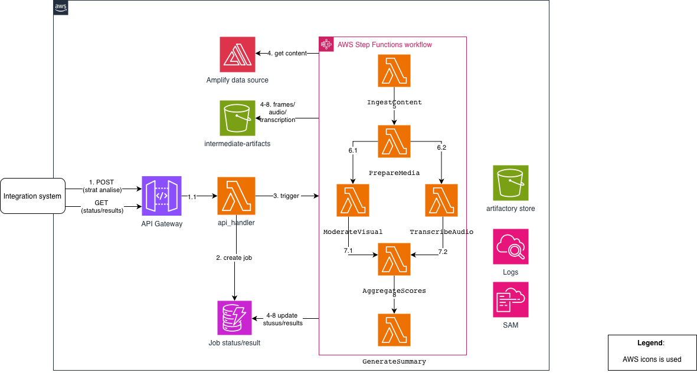

# Social Campaign Analyzer

## Functional View



## Analysis API

This service exposes an asynchronous job API for campaign content analysis.

### Endpoints

1. `POST /v1/analysis-jobs`
  Trigger a new analysis job.
2. `GET /v1/analysis-jobs/{job_id}`
  Fetch job status and final result.

---

## 1) Create Analysis Job

`POST /v1/analysis-jobs`

### Request

```json
{
  "campaign_id": "cmp_123",
  "source": {
    "type": "amplify",
    "reference_id": "amplify_campaign_987"
  }
}
```

### Response

`202 Accepted`

```json
{
  "job_id": "job_01JXYZ...",
  "status": "queued",
  "created_at": "2026-02-17T18:20:00Z",
  "status_url": "/v1/analysis-jobs/job_01JXYZ..."
}
```

### Notes

1. Use `Idempotency-Key` header to avoid duplicate job creation.
2. API validates `campaign_id` and `source.reference_id`.
3. The service returns immediately and processes analysis asynchronously.

---

## 2) Get Job Status / Result

`GET /v1/analysis-jobs/{job_id}`

### In-progress Response

`200 OK`

```json
{
  "job_id": "job_01JXYZ...",
  "status": "running",
  "progress": {
    "ingest_content": "completed",
    "prepare_media": "completed",
    "transcribe_audio": "running",
    "moderate_text": "pending",
    "moderate_visual": "pending",
    "aggregate_scores": "pending",
    "generate_summary": "pending"
  },
  "created_at": "2026-02-17T18:20:00Z",
  "updated_at": "2026-02-17T18:21:10Z"
}
```

### Completed Response

`200 OK`

```json
{
  "job_id": "job_01JXYZ...",
  "status": "completed",
  "result": {
    "overall_visual_safety_score": 92.4,
    "overall_text_safety_score": 86.3,
    "visual": {
      "overall_score": 92.4,
      "categories": [
        {
          "name": "adult_content",
          "score": 96.0,
          "status": "Safe"
        },
        {
          "name": "violence_weapons",
          "score": 91.0,
          "status": "Safe"
        },
        {
          "name": "racy_content",
          "score": 88.0,
          "status": "Warning"
        },
        {
          "name": "medical_gore",
          "score": 95.0,
          "status": "Safe"
        },
        {
          "name": "spoof_fake_content",
          "score": 84.0,
          "status": "Warning",
          "explanation": "Potential manipulated media indicators detected."
        }
      ]
    },
    "text": {
      "overall_score": 86.3,
      "categories": [
        {
          "name": "profanity",
          "score": 90.0,
          "status": "Safe"
        },
        {
          "name": "hate_speech",
          "score": 93.0,
          "status": "Safe"
        },
        {
          "name": "misinformation",
          "score": 80.0,
          "status": "Warning"
        },
        {
          "name": "brand_mentions",
          "score": 82.0,
          "status": "Warning",
          "explanation": "Brand mention detected without clear context."
        },
        {
          "name": "disclosure_compliance",
          "score": 78.0,
          "status": "Warning",
          "explanation": "Missing clear sponsorship disclosure markers."
        },
        {
          "name": "political_content",
          "score": 87.0,
          "status": "Safe"
        }
      ]
    },
    "human_summary": "Creator content is mostly safe. Key risks are spoof/fake signals and disclosure quality."
  },
  "created_at": "2026-02-17T18:20:00Z",
  "updated_at": "2026-02-17T18:23:40Z"
}
```

---

## Status Model

Job-level status values:

1. `queued`
2. `running`
3. `completed`
4. `failed`

---

## HTTP Errors

1. `400` invalid request payload.
2. `404` job not found.
3. `409` idempotency conflict.
4. `500` internal error while creating job.

---

## Architecture Solution

### Goal

Provide a reliable and cost-effective asynchronous content analysis pipeline using serverless AWS components.

### AWS Components

1. API Gateway
2. Lambda (`api_handler`) for `POST /v1/analysis-jobs` and `GET /v1/analysis-jobs/{job_id}`
3. Step Functions (workflow orchestration)
4. Lambda workers per pipeline stage
5. DynamoDB (`analysis_jobs`) for job status and final output
6. S3 for intermediate artifacts (ingestion output, transcripts, moderation raw responses)
7. AWS Secrets Manager for third-party API keys
8. CloudWatch Logs/Metrics for observability

### State Machine Breakdown

1. `IngestContent`
2. `PrepareMedia`
3. `ParallelAnalysis`
  - `TranscribeAudio` -> `ModerateText`
  - `ModerateVisual`
4. `AggregateScores`
5. `GenerateSummary`

### State Responsibilities

1. `IngestContent`
  - Normalizes campaign input from Amplify source reference.
  - Stores ingestion artifact in S3 and writes ingestion metadata to DynamoDB.
2. `PrepareMedia`
  - Prepares media-processing metadata (audio extraction/frame sampling placeholders).
  - Updates stage metadata in DynamoDB for observability.
3. `TranscribeAudio`
  - Produces transcript artifact (blueprint placeholder in current scaffold).
  - Stores transcript artifact in S3 and transcript metadata in DynamoDB.
4. `ModerateText`
  - Produces text moderation output (blueprint placeholder in current scaffold).
  - Stores moderation artifact in S3 and compact moderation metadata in DynamoDB.
5. `ModerateVisual`
  - Produces visual moderation output (blueprint placeholder in current scaffold).
  - Stores moderation artifact in S3 and compact moderation metadata in DynamoDB.
6. `AggregateScores`
  - Combines text and visual moderation into a single analysis payload.
  - Stores aggregate artifact in S3 and aggregate score metadata in DynamoDB.
7. `GenerateSummary`
  - Generates human-readable summary using Claude (or deterministic fallback).
  - Stores final result artifact in S3 and persists terminal job result/status in DynamoDB.

### Data Flow Between Stages

The workflow passes compact metadata and artifact references, not large payloads.

```json
{
  "job_id": "job_01JXYZ",
  "campaign_id": "cmp_123",
  "source": {
    "type": "amplify",
    "reference_id": "amplify_campaign_987"
  },
  "artifacts": {
    "ingestion_s3_uri": "s3://bucket/jobs/job_01JXYZ/ingestion.json",
    "transcript_s3_uri": "s3://bucket/jobs/job_01JXYZ/transcript.json",
    "visual_s3_uri": "s3://bucket/jobs/job_01JXYZ/visual.json",
    "text_s3_uri": "s3://bucket/jobs/job_01JXYZ/text.json",
    "aggregate_s3_uri": "s3://bucket/jobs/job_01JXYZ/aggregate_scores.json",
    "final_s3_uri": "s3://bucket/jobs/job_01JXYZ/final.json"
  },
  "stage_outputs": {
    "ingest_content": {
      "ingestion_s3_uri": "s3://bucket/jobs/job_01JXYZ/ingestion.json",
      "source_type": "amplify",
      "post_count": 0
    },
    "transcribe_audio": {
      "transcript_s3_uri": "s3://bucket/jobs/job_01JXYZ/transcript.json",
      "segment_count": 0,
      "has_text": false
    }
  }
}
```

### Reliability Strategy

1. API is asynchronous: `POST` returns `202` quickly with `job_id`.
2. Step-level retries with exponential backoff for transient provider/network failures.
3. Step payload + S3 artifact references drive state transitions (no DynamoDB fallback read path).
4. DynamoDB stores status/progress and compact stage metadata only.
5. S3 stores large outputs to keep workflow state small.

### Latency and Cost Notes

1. Use parallel moderation paths to reduce end-to-end latency.
2. Process only selected keyframes instead of every video frame.
3. Skip transcription when no audio is available.
4. Use pay-per-use serverless compute and tune Lambda memory per stage.

---

## Code Structure

```text
services/
  api_handler/
    handler.py
    requirements.txt
  ingest_content/
    handler.py
    requirements.txt
  prepare_media/
    handler.py
    requirements.txt
  transcribe_audio/
    handler.py
    requirements.txt
  moderate_text/
    handler.py
    requirements.txt
  moderate_visual/
    handler.py
    requirements.txt
  aggregate_scores/
    handler.py
    requirements.txt
  generate_summary/
    handler.py
    summary_client.py
    requirements.txt
shared/
  config.py
  http.py
  job_store.py
  s3_store.py
  workflow_utils.py
stepfunctions/
  campaign_analysis_workflow.asl.json
cicd/
  sam/
    template.yaml
    workflow.asl.json
    README.md
```

### Packaging Strategy

1. Build one deployment artifact per service under `services/<lambda_name>`.
2. Do not package the whole repository into each Lambda.
3. Include `shared/` via:
  - a Lambda Layer (`python/shared/...`) preferred, or
  - copying `shared/` into each Lambda build artifact.
4. Keep service-specific code local (for example `generate_summary/summary_client.py` only in summary Lambda).

### Shared Modules

Shared modules contain cross-cutting concerns only:

1. `config.py`: environment configuration
2. `http.py`: API response/body helpers
3. `job_store.py`: DynamoDB status/progress/result persistence
4. `s3_store.py`: artifact JSON writes to S3
5. `workflow_utils.py`: common workflow handler utilities (job id, stage completion/failure helpers)

### Legacy Note

Previous `src/common` and `src/handlers` layout was replaced with per-Lambda service folders to support isolated builds and smaller deployment artifacts.

Root `requirements.txt` can still be used for local development tooling/tests. Lambda packaging should use each service's `requirements.txt`.

### Implementation Scope

1. `generate_summary` is implemented end-to-end:
  - builds summary input
  - calls Claude API via official Anthropic Python SDK (with fallback when API key is missing/unavailable or API call fails)
  - writes final artifact to S3
  - persists final result/status to DynamoDB
2. Other step handlers are blueprint handlers:
  - parse expected input
  - produce placeholder output payload
  - write stage artifact and compact stage metadata to DynamoDB
  - return normalized event for next state

---

## Environment Variables

1. `ANALYSIS_TABLE_NAME` (default: `analysis_jobs`)
2. `STATE_MACHINE_ARN` (required for `POST /v1/analysis-jobs`)
3. `ARTIFACTS_BUCKET` (optional, for S3 artifact writes)
4. `ANTHROPIC_API_KEY` (optional, enables real Claude summary call)
5. `ANTHROPIC_MODEL` (default: `claude-sonnet-4-6`)

---

## Testing

Run tests with `pytest`:

```bash
PYTHONPATH=. python3 -m pytest -q
```

---

## Step Function Definition

State machine JSON is located at:

`stepfunctions/campaign_analysis_workflow.asl.json`

Replace placeholder Lambda ARNs before deployment:

1. `<INGEST_CONTENT_LAMBDA_ARN>`
2. `<PREPARE_MEDIA_LAMBDA_ARN>`
3. `<TRANSCRIBE_AUDIO_LAMBDA_ARN>`
4. `<MODERATE_TEXT_LAMBDA_ARN>`
5. `<MODERATE_VISUAL_LAMBDA_ARN>`
6. `<AGGREGATE_SCORES_LAMBDA_ARN>`
7. `<GENERATE_SUMMARY_LAMBDA_ARN>`
